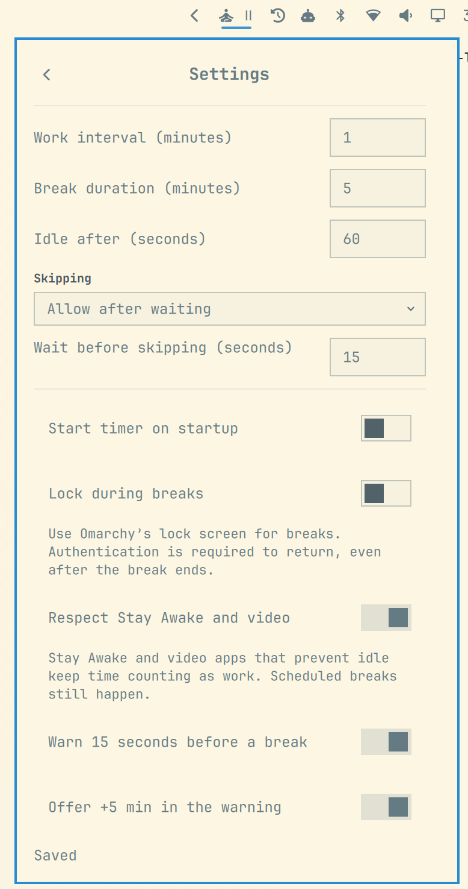

# Omadoro

A small work/break timer for Omarchy's built-in Quickshell bar. Work for **50 minutes**, take a **5-minute break**, and repeat. Uses your desktop theme and pauses work while you're idle.

| Timer | Break warning | Screen break |
| :---: | :---: | :---: |
| [](docs/screenshots/timer.png) | [](docs/screenshots/warning.png) | [](docs/screenshots/break.png) |

## Quickstart

For **Omarchy 4’s built-in bar**. Older Waybar setups aren’t supported.

Requires Omarchy's Quickshell environment and the `python`, `python-dbus`, and `python-gobject` packages. Optional session locking uses `omarchy system lock` and `omarchy-shell`.

```sh
omarchy plugin add https://github.com/klaudworks/omadoro.git --enable
```

Click the meditator in the bar, then **Break now** to try it. By default, **Escape** or **Skip** returns you to work.

## Highlights

- Shows the remaining time in the bar and uses your desktop theme.
- Configurable work and break durations, with pause, reset, and +5 minute controls.
- Optional 15-second warning before full-screen breaks.
- Counts time away as rest, respecting Stay Awake and video inhibitors by default.
- Optional **Lock during breaks** setting uses Omarchy’s lock screen so you can leave your desk. Wait for the lock screen before leaving; authentication is required to return, even after the break ends.

Suspend/resume and physical monitor changes with session locking have not been fully verified.

<details>
<summary>See all settings</summary>

<p align="center">
  <a href="docs/screenshots/settings.png"></a>
</p>

</details>

To update, run `omarchy plugin update klaudworks.omadoro`, then `omarchy restart shell` to reload the timer. Settings are preserved.

To disable:

```sh
omarchy plugin disable klaudworks.omadoro
```

To uninstall: `omarchy plugin remove klaudworks.omadoro`.

## Local development installer

`python scripts/install-local.py` installs a separate checkout into `~/.config/omarchy/plugins/klaudworks.omadoro`. It requires user-owned destination directories that are not writable by other users and rejects symlinks and special files in the existing plugin and copied source trees.

The installer validates a fresh, private staging copy before disabling the old plugin, then uses Linux `renameat2` to exchange the directories atomically. It enables the plugin, restores saved settings and bar placement through Omarchy's APIs, and restarts the shell. Failed activation rolls back the files and attempts to restore the previous desktop state. Successful updates retain the previous plugin and saved settings in the printed private recovery directory beside the installation. If rollback fails, recovery files are retained there for manual recovery. The standard installation command above does not run this development helper.
