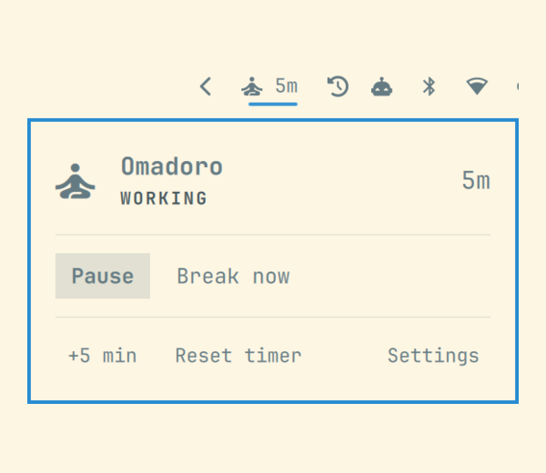
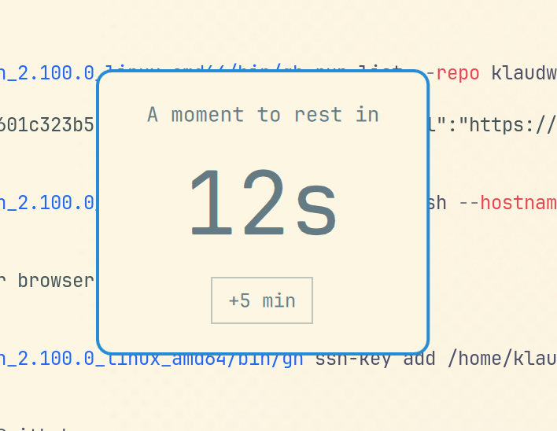
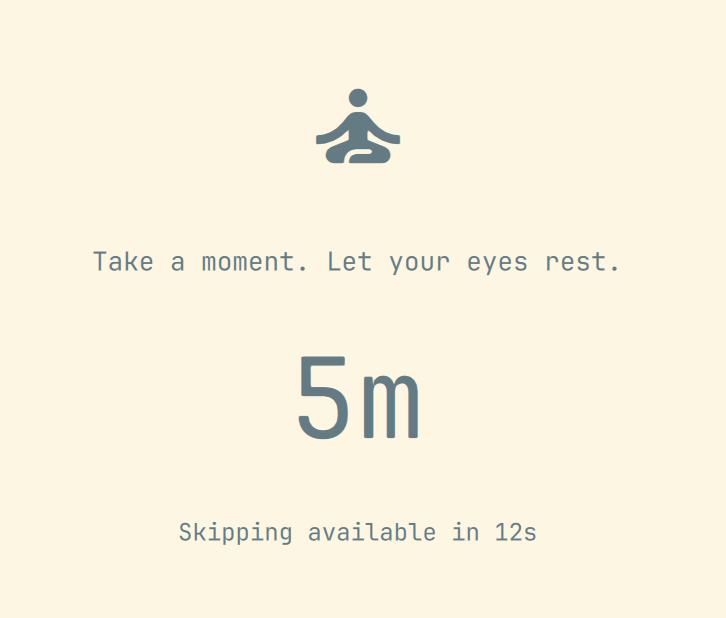

# Omadoro

A small work/break timer for Omarchy's built-in Quickshell bar. Work for **50 minutes**, take a **5-minute break**, and repeat. Uses your desktop theme and pauses work while you're idle.

| Timer | Break warning | Screen break |
| :---: | :---: | :---: |
| [](docs/screenshots/timer.png) | [](docs/screenshots/warning.png) | [](docs/screenshots/break.png) |

## Quickstart

Prototype for **Omarchy 4's built-in Quickshell shell**, currently running on **4.0.3**. Requires `git`, `python`, `python-dbus`, and `python-gobject`. The classic Waybar setup isn't supported.

```sh
omarchy plugin add https://github.com/klaudworks/omadoro.git --enable
```

The timer starts automatically. Click the meditator in the bar, then **Break now** to try it; **Escape** or **Skip** returns you to work with the default settings.

## Make it yours

- **Pause / Resume** controls the work timer. **+5 min** postpones a break; **Reset timer** restores a full work interval.
- **Settings** lets you change durations, idle detection, autostart, the 15-second warning, and whether breaks can be skipped immediately, after a wait, or never. Changes save automatically.
- Breaks cover your screens. A long enough idle period counts as a break. Normal desktop locking remains enabled. Only preferences persist; restarting the shell starts a fresh timer.

To update, run `omarchy plugin update klaudworks.omadoro`, then `omarchy restart shell` to reload the timer. Settings are preserved.

To disable:

```sh
omarchy plugin disable klaudworks.omadoro
```

To uninstall: `omarchy plugin remove klaudworks.omadoro`.

[Development and known limitations](docs/development.md) · [MIT license](LICENSE)
